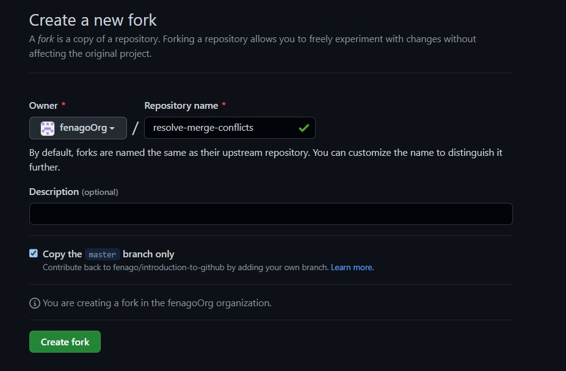
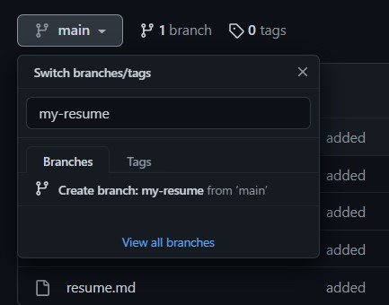
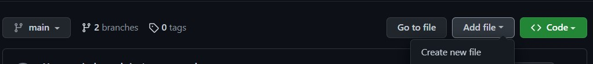

# Resolve merge conflicts

_Learn why conflicts happen and how to resolve them._

Merge conflicts happen when two people make changes to the same file on GitHub—a common occurrence when you’re working with others. While resolving differences might involve some discussion, merge conflicts don’t have to be scary. This course guides you through the steps to finding the best merge conflict solution, so your team can keep building.

- **Who is this for**: New developers, new GitHub users, users new to Git, students, managers, teams.
- **What you'll learn**: What merge conflicts are, how you resolve merge conflicts, how to reduce merge conflicts.
- **What you'll build**: We'll work with a short Markdown resume file in this course.
- **How long**: This course is three steps long and takes less than 30 minutes to complete.

## How to start this course

1. Open following URL in browser, click **Fork** and open the link in a new tab.
   `https://github.com/fenago/resolve-merge-conflicts`

   
2. In the new tab, follow the prompts to create a new repository.
   - For owner, choose your personal account or an organization to host the repository.
   - We recommend creating a public repository—private repositories will [use Actions minutes].
    
3. After your new repository is created, wait about 20 seconds, then refresh the page. Follow the step-by-step instructions in the new repository's README.

<h2>Step 1: Resolve a merge conflict</h2>

_Welcome to "Managing Merge Conflicts"! :wave:_

**What is a _merge conflict_?**: A **merge conflict** occurs when changes are made to the same part of the same file on two different branches. You usually find out about conflicts in a pull request.

This can be intimidating, but have no fear, Git is smart when it comes to merging! Git only needs a human to decide how to [resolve the conflict]. Sometimes, the best way to resolve a merge conflict is to add content that's from both branches, or even something that isn't on either! This is why Git needs a human to look at the code and make the proper fixes.

### Activity: Create your own conflict

1. Create new branch `my-resume` from `main` branch.

1. Select `main` branch and Create a new file called `references.md` and pushed that change to `main`, without updating your `my-resume` branch.

1. Browse to the `my-resume` branch.
1. Click the `Add file` dropdown menu and then on `Create new file`.
1. Create a file named `references.md`.
1. Enter some text that conflicts with what we added for `references.md` in the `main` branch.
1. Scroll to the bottom of the page and enter a commit message for your change.
1. Click the **Commit new file** button, making sure the "Commit directly to the `my-resume` branch" option is selected.

<h2>Step 2: Create pull request</h2>

### Activity: Create pull request
1. Create new pull request to merge `my-resume` branch into main.

<h2>Step 3: Merge your pull request</h2>

You can now [merge] your pull request!

### Activity: Merge your pull request

1. First, resolve any remaining conflicts in your pull request.
1. Click **Merge pull request**.
1. Delete the branch `my-resume` (optional).

<h2>Finish</h2>

Here's a recap of all the tasks you've accomplished in your repository:

- You learned why merge conflicts happen.
- You resolved a simple merge conflict.
- You created a merge conflict, and resolved it!
